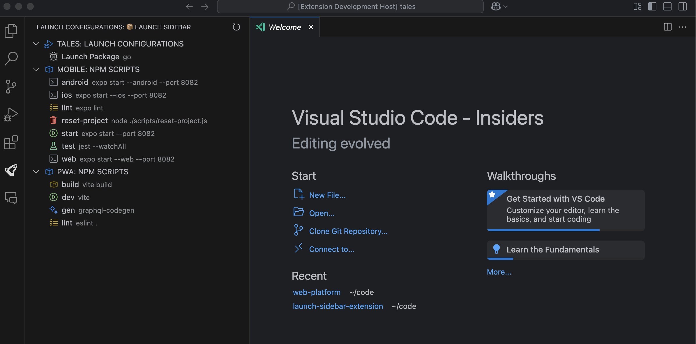

# Launch Sidebar

Launch Sidebar is a VS Code extension that provides a convenient way to manage and run debug configurations, npm scripts, and JetBrains run configurations from a dedicated sidebar. It offers one-click execution of tasks with intelligent package manager detection (npm, yarn, pnpm) and support for JetBrains IDE run configuration files.

## Key Features

### Debug Configurations
- 🚀 View and launch debug configurations from all workspace folders
- 🔄 Live updates when launch.json files change
- ⚙️ One-click edit button for easy configuration modification
- 🔍 Clearly organized by workspace folder with prominent section headers

### NPM Scripts
- 📦 Intelligent package manager detection (npm, yarn, pnpm)
- 🎨 Color-coded icons for different script types
- ▶️ One-click script execution with the correct package manager
- 🛠️ Support for monorepos with nested package.json files

### JetBrains Run Configurations
- 🧠 Support for JetBrains IDE run configurations (.run/*.xml files)
- 🔍 Automatic detection of configurations from GoLand, IntelliJ, WebStorm, etc.
- ▶️ Run Go applications, tests, Node.js apps, and more directly from VS Code
- 🛠️ Edit the XML configuration files with a single click

### User Experience
- 🌟 Clean, organized sidebar with hierarchical sections
- 🔠 Alphabetical sorting for easy navigation
- 🔄 Refresh button to manually update configurations and scripts
- 🖱️ Separation of selection and execution actions

## Getting Started

1. Install the extension from the [VS Code Marketplace](https://marketplace.visualstudio.com/items?itemName=arthurvaverko.launch-sidebar)
2. Click on the rocket icon in the activity bar to open the Launch Sidebar
3. Browse your debug configurations and npm scripts organized by workspace folder
4. Click the play button (▶️) next to any item to run it
5. Click the gear icon (⚙️) to edit the configuration or script

## Smart Package Manager Detection

The extension automatically determines the appropriate package manager for your npm scripts:

1. Checks package.json for explicit package manager definitions
2. Looks for lock files (package-lock.json, yarn.lock, pnpm-lock.yaml)
3. Uses the same package manager for all scripts within a workspace for consistency
4. Falls back to npm when no specific manager is detected

## Customization

The extension provides visual distinctions for different script types:

- 🧪 **Test scripts** (test, e2e, spec): Purple beaker icon
- 📦 **Build scripts** (build, compile): Orange package icon
- ▶️ **Dev scripts** (dev, start): Green play icon
- ✨ **Generate scripts** (gen, generate): Blue sparkle icon
- ✓ **Lint scripts** (lint, eslint): Yellow checklist icon
- 🗑️ **Clean scripts** (clean, clear): Red trash icon
- 📤 **Export scripts** (export, publish): Cyan export icon
- 👁️ **Preview scripts** (preview, view): Light blue preview icon
- 🐞 **Debug scripts** (debug): Orange-red debug icon
- 🚀 **Deploy scripts** (deploy, upload): Pink rocket icon

## Requirements

- Visual Studio Code 1.74.0 or higher
- For debug configurations: At least one workspace folder with `.vscode/launch.json`
- For npm scripts: At least one `package.json` file with scripts defined
- For JetBrains configurations: A `.run` folder with XML configuration files

## Known Issues

- If a launch.json file contains syntax errors, those configurations may not be displayed properly, but the extension will show an error message.
- Complex variable substitutions in launch configurations might not be fully resolved in the display.
- Some package manager-specific features (like yarn workspaces) might not be fully integrated.

## Privacy

This extension does not collect any data or send any telemetry information.

## Contributing

Contributions are welcome! Feel free to submit a Pull Request on [GitHub](https://github.com/arthurvaverko/launch-sidebar-extension).

## License

This extension is licensed under the [MIT License](LICENSE).

## Release Notes

### 0.0.7
- Fixed error "No view is registered with id: launchConfigurationsView"
- Added terminal reuse functionality to prevent opening new terminals for each command execution
- Fixed command handling for all item types (launch configs, scripts, JetBrains configs)
- Implemented proper terminal management for better user experience

### 0.0.6
- Complete rewrite of JetBrains configuration parser using proper XML parsing
- Robust support for ShConfigurationType configurations
- Fixed handling of all shell script configuration options
- Added support for .run.xml file extension format

### 0.0.5
- Added support for JetBrains ShConfigurationType (shell scripts)
- Enhanced XML parsing for JetBrains configurations

### 0.0.4
- Fixed compatibility with Cursor (VS Code 1.96.2)

### 0.0.3
- Fix finding JetBrains config
- Fix running JetBrains confing with project_dir variables

### 0.0.2
- Added support for JetBrains run configurations (.run/*.xml files)
- Added ability to run Go applications, tests, and other configurations from JetBrains IDEs
- Fixed bug: Excluded node_modules directories when scanning for npm packages
- Improved UI consistency for all configuration types
- Added file watchers for JetBrains configuration files

### 0.0.1
- Initial release
- Support for debug configurations and npm scripts
- Smart package manager detection
- Color-coded icons for different script types
- Hierarchical organization of configurations

---

## Following extension guidelines

Ensure that you've read through the extensions guidelines and follow the best practices for creating your extension.

* [Extension Guidelines](https://code.visualstudio.com/api/references/extension-guidelines)

## Working with Markdown

You can author your README using Visual Studio Code. Here are some useful editor keyboard shortcuts:

* Split the editor (`Cmd+\` on macOS or `Ctrl+\` on Windows and Linux).
* Toggle preview (`Shift+Cmd+V` on macOS or `Shift+Ctrl+V` on Windows and Linux).
* Press `Ctrl+Space` (Windows, Linux, macOS) to see a list of Markdown snippets.

## For more information

* [Visual Studio Code's Markdown Support](http://code.visualstudio.com/docs/languages/markdown)
* [Markdown Syntax Reference](https://help.github.com/articles/markdown-basics/)

**Enjoy!**
# launch-sidebar-extension
